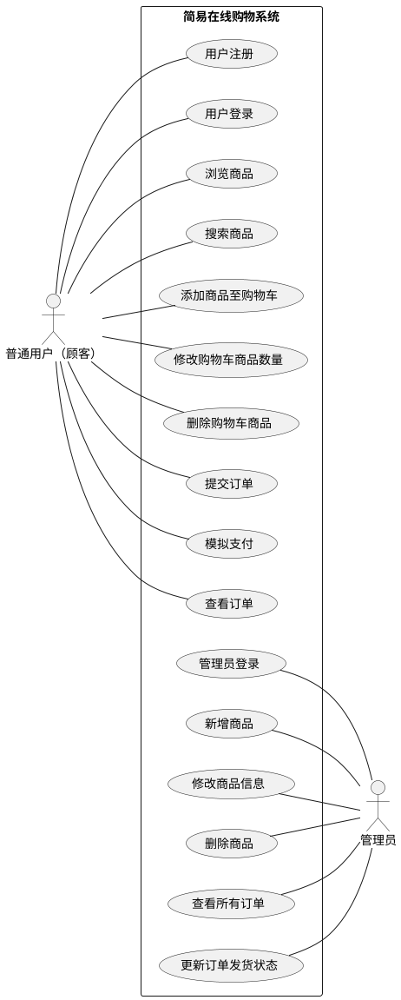

# 简易在线购物系统 — 需求分析

## 1.  项目目标

本系统实现一个小型电子商务平台的核心功能，具备以下目标：
- 为用户提供浏览商品、加入购物车、下单、支付和查看订单的功能 
- 为管理员提供商品管理与订单增删改查功能 
- 提供良好的交互界面与清晰的业务逻辑 
- 支持基本的用户信息与商品数据存储 

---

## 2. 系统概述

系统分为两个主要角色：
- **普通用户（顾客）**：进行购物相关操作 
- **管理员**：进行商品与订单的后台管理 

系统采用浏览器-服务器（B/S）架构，用户通过浏览器访问网站完成购物流程，后端服务器负责业务逻辑与数据处理 

---

## 3. 功能需求分析

### 3.1 用户端功能

| 功能模块    | 功能描述                        |
| ------- | --------------------------- |
| 用户注册与登录 | 用户可以注册新账号并登录系统              |
| 浏览商品    | 查看商品列表、详情、分类、价格等信息          |
| 搜索商品    | 按关键词或类别查找商品                 |
| 购物车管理   | 添加商品至购物车、修改数量、删除商品          |
| 提交订单    | 从购物车生成订单，确认收货信息并下单          |
| 支付      | 模拟支付流程                      |
| 查看订单    | 查看历史订单及其状态（待支付、已发货、已完成、已取消） |

### 3.2 管理员功能

| 功能模块 | 功能描述          |
| ---- | ------------- |
| 管理登录 | 管理员账号登录后台     |
| 商品管理 | 新增、修改、删除商品信息  |
| 查看订单 | 查看用户订单，更新发货状态 |

---

## 4. 非功能需求分析

| 类别   | 描述                      |
| ---- | ----------------------- |
| 性能要求 | 系统可在个人电脑上本地运行，响应时间不超过2秒 |
| 安全性  | 用户需通过登录认证访问个人订单信息       |
| 可维护性 | 系统结构清晰，模块划分明确，便于后续扩展    |
| 易用性  | 界面简洁直观，操作流程清晰           |
| 可移植性 | 系统基于Web架构，可在不同浏览器中运行    |

---

## 5. 数据需求分析

### 5.1 主要数据实体

| 实体名称           | 属性示例                                                 |
| -------------- | ---------------------------------------------------- |
| 用户（User）       | user_id, username, password, email                   |
| 商品（Product）    | product_id, name, price, stock, description          |
| 购物车（Cart）      | cart_id, user_id, product_id, quantity               |
| 订单（Order）      | order_id, user_id, total_price, status, create_time  |
| 订单项（OrderItem） | order_item_id, order_id, product_id, quantity, price |

### 5.2 数据关系
- 一个用户可拥有多个订单 
- 一个订单包含多个订单项 
- 每个订单项对应一个商品 
- 购物车与用户是一对一关系 

---

## 6. 运行环境

| 项目   | 推荐配置          |
| ---- | ------------- |
| 操作系统 | Windows       |
| 浏览器  | Chrome / Edge |
| 后端环境 | Java          |
| 数据库  | MySQL         |
| 工具   | IntelliJ IDEA |

---

## 7. 系统用例图

