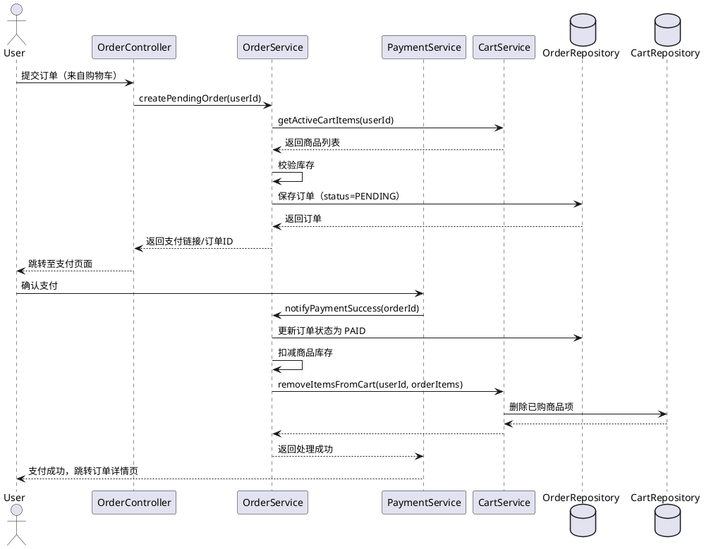
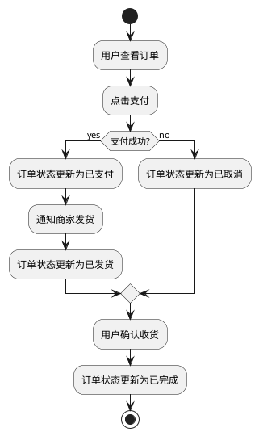
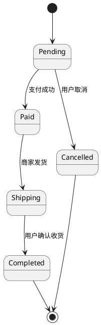

# 简易在线购物系统 — 详细设计

## 一、交互流程设计

系统采用 **前后端分离 + REST API** 交互模式：

1. 用户访问前端页面（Vue）  
2. 前端通过 Axios 调用 Spring Boot 后端 REST API  
3. 后端接收请求后，Controller 调用 Service 层处理业务逻辑  
4. Service 层操作 Repository 层访问数据库（JPA）  
5. Service 返回结果给 Controller  
6. Controller 封装成统一 ResponseDTO 返回前端  
7. 前端根据返回结果更新页面显示  

---

## 二、订单状态流转设计

| 状态              | 描述           | 触发事件       |
| --------------- | ------------ | ---------- |
| 待支付 (Pending)   | 用户已生成订单，但未支付 | 用户点击“支付”   |
| 已取消 (Cancelled) | 用户取消         | 用户点击"取消订单" |
| 已支付 (Paid)      | 用户完成支付       | 支付网关回调     |
| 已发货 (Shipping)  | 商家发货         | 管理员标记发货    |
| 已完成 (Completed) | 用户确认收货       | 用户点击“确认收货” |

---

## 三、时序图 —— 用户下单

---

## 四、活动图 —— 订单支付流程

---

## 五、状态图 —— 订单状态流转

