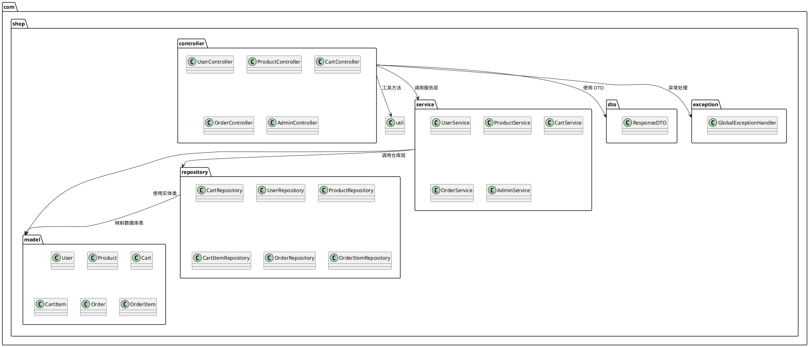
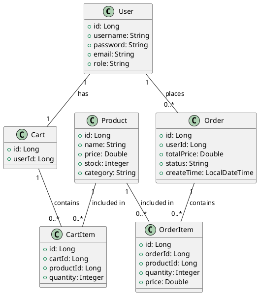

# 简易在线购物系统 — 概要设计
## 一、系统模块划分

系统采用 **三层架构 + 前后端分离** 设计，主要模块划分如下：

| 模块            | 功能                           |
| ------------- | ---------------------------- |
| 用户模块（User）    | 注册、登录、修改用户信息                 |
| 管理员模块（Admin）  | 商品管理、用户管理、订单管理、统计数据          |
| 商品模块（Product） | 商品增删改查、商品详情、分类、价格、搜索         |
| 购物车模块（Cart）   | 添加、删除、修改购物车商品，结算购物车          |
| 订单模块（Order）   | 下单、支付、订单状态（待支付、已发货、已完成）、订单历史 |
| 公共模块（Common）  | 文件上传、异常处理、分页、统一响应格式          |

---

## 二、主要类设计

根据模块划分，系统的主要类如下：

### 1. 用户模块

| 类名             | 类型     | 主要属性                                | 功能                      |
| -------------- | ------ | ----------------------------------- | ----------------------- |
| User           | 实体类    | id, username, password, email, role | 映射用户表                   |
| UserController | 控制器    | -                                   | 提供注册、登录、修改接口            |
| UserService    | 服务类    | -                                   | 处理用户业务逻辑                |
| UserRepository | 数据访问接口 | -                                   | CRUD 操作（JPA Repository） |

### 2. 商品模块

| 类名 | 类型 | 主要属性 | 功能 |
|------|------|-----------|------|
| Product | 实体类 | id, name, price, stock, category | 映射商品表 |
| ProductController | 控制器 | - | 提供商品增删改查接口 |
| ProductService | 服务类 | - | 商品业务逻辑处理 |
| ProductRepository | 数据访问接口 | - | CRUD 操作 |

### 3. 购物车模块

| 类名             | 类型     | 主要属性                       | 功能            |
| -------------- | ------ | -------------------------- | ------------- |
| Cart           | 实体类    | id, userId, List<CartItem> | 映射购物车         |
| CartItem       | 实体类    | id, productId, quantity    | 购物车商品条目       |
| CartController | 控制器    | -                          | 添加/删除/修改购物车商品 |
| CartService    | 服务类    | -                          | 购物车业务逻辑       |
| CartRepository | 数据访问接口 | -                          | CRUD 操作       |

### 4. 订单模块

| 类名 | 类型 | 主要属性 | 功能 |
|------|------|-----------|------|
| Order | 实体类 | id, userId, totalPrice, status, createTime | 映射订单表 |
| OrderItem | 实体类 | id, orderId, productId, quantity, price | 订单条目 |
| OrderController | 控制器 | - | 提交订单、查询订单 |
| OrderService | 服务类 | - | 订单处理业务逻辑 |
| OrderRepository | 数据访问接口 | - | CRUD 操作 |

### 5. 管理员模块

| 类名              | 类型  | 主要属性 | 功能             |
| --------------- | --- | ---- | -------------- |
| AdminController | 控制器 | -    | 商品审核、订单审核、用户管理 |
| AdminService    | 服务类 | -    | 管理业务逻辑         |

### 6. 公共模块

| 类名               | 类型    | 功能     |
| ---------------- | ----- | ------ |
| ResponseDTO      | DTO   | 统一响应格式 |
| ExceptionHandler | 异常处理类 | 全局异常拦截 |

---

## 三、包图设计

## 四、 类图设计

